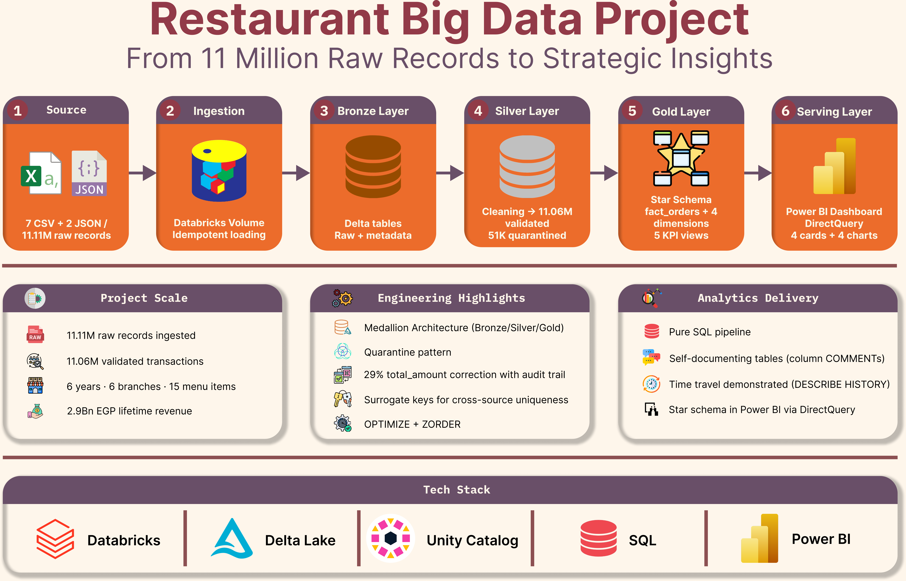
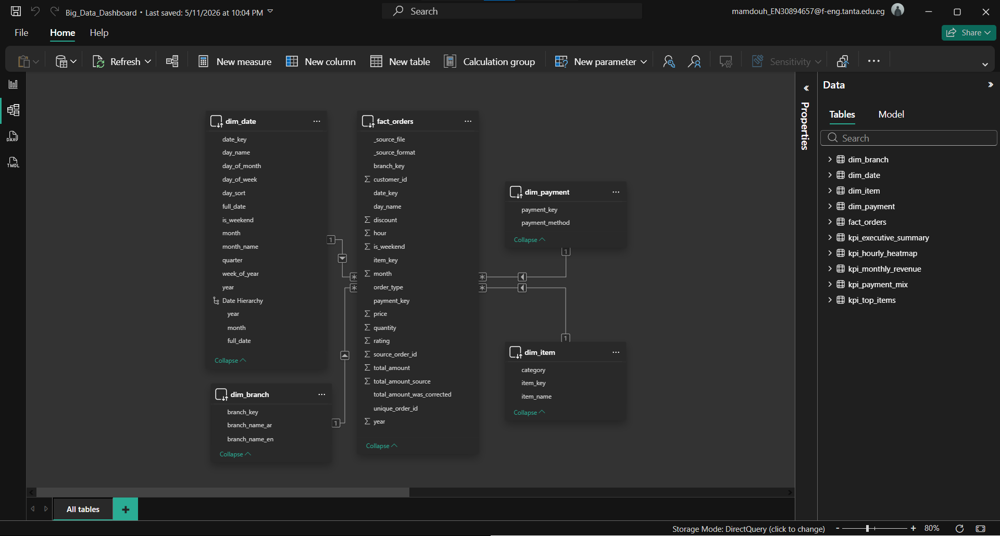
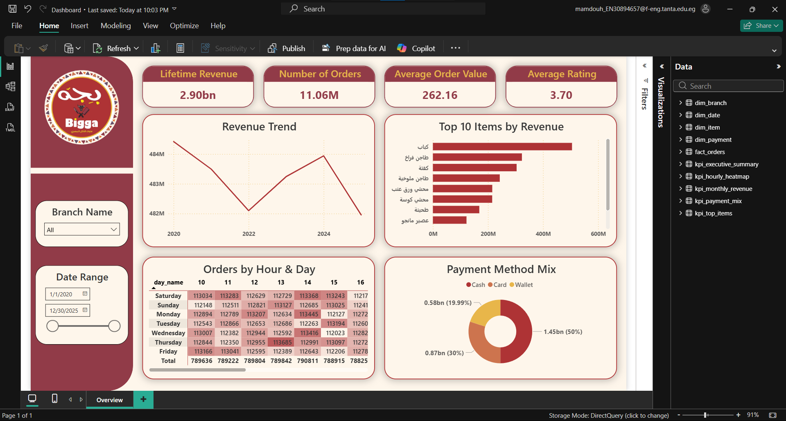

# Bigga Restaurant — Big Data Analytics Pipeline

### From 11 Million Raw Records to Strategic Insights

An end-to-end Big Data engineering project processing **11.11 million Egyptian restaurant transactions** using the Databricks Lakehouse, pure SQL on Delta Lake, and Power BI.

> *"Bigga" (بجة) — ملوك الأكل المصري ("Kings of Egyptian Food") — is a restaurant brand that is used for this analytical case study.*
> *The dataset represents a realistic 11M-row sample of Egyptian restaurant operations across 6 branches over 6 years (2020–2025).*

---

## Architecture

The pipeline implements the **Medallion Architecture** (Bronze → Silver → Gold) entirely in pure SQL on Databricks, with a Power BI dashboard layered on top via DirectQuery.

---

## Project Snapshot

| Metric | Value |
|---|---|
| Source records | 11,110,000 |
| Validated transactions | 11,058,558 |
| Quarantined records | 51,442 (preserved for audit) |
| Lifetime revenue | EGP 2,899,147,052 (~2.9B EGP) |
| Date range | 2020-01-01 to 2025-12-30 |
| Branches | 6 (Cairo, Alexandria, Giza, Mansoura, Tanta, Asyut) |
| Menu items | 15 across 5 categories |
| Source format | 7 CSV + 2 JSON files |

---

## Key Business Findings

1. **29.07% of source `total_amount` values were inaccurate**: 3.2M rows had financial calculations that did not match `price × quantity × (1 − discount)`, where these were corrected in the Silver layer with full audit trail preservation (original values kept in `total_amount_source`).

2. **2 million apparent duplicate order_ids**: were investigated and confirmed as **distinct transactions from separate POS exports**, not redundant duplicates.

4. **A surrogate key strategy** (`unique_order_id = source_file + '_' + order_id`) preserved all 11.06M valid transactions instead of discarding millions of legitimate records.

5. **Top 3 menu items generate 39% of all revenue**: Kebab (17.4%), Chicken Tagine (11.2%), and Kofta (10.5%), where The bottom item (Tea) contributes only 0.7%, suggesting clear menu performance differentiation.

6. **Sunday revenue (~EGP 483M) clusters with weekend days**: (Friday/Saturday) rather than other weekdays (~EGP 362M), where a **33% revenue lift** worth investigating for marketing strategy, despite Sunday being a working day in Egypt.

7. **Cash dominates at 50% of transactions**: Average order value (~EGP 262) is identical across all payment methods, meaning payment channel does not influence basket size.

---

## Pipeline Steps

| Step | Layer | What was built |
|---|---|---|
| 1 | Setup | Unity Catalog with `bronze`, `silver`, `gold` schemas + raw files Volume |
| 2 | Bronze | Raw ingestion via `COPY INTO` from Volume (idempotent, schema-enforced) |
| 3 | Bronze | 16-check Data Quality Report view profiling data before transformation |
| 4 | Silver | Cleaned orders table + Quarantine table (zero rows silently dropped) |
| 5 | Silver | Time enrichment (year, month, day_name columns) |
| 6 | Gold | Star schema: `fact_orders` + 4 dimension tables with INT surrogate keys |
| 7 | Gold | 5 pre-aggregated KPI views for dashboard performance |
| 8 | Gold | `OPTIMIZE` + `ZORDER` on largest tables for Power BI query speed |
| 9 | Gold | Column-level `COMMENTS` + `TBLPROPERTIES` for self-documenting tables |

---

## Star Schema Model

A clean dimensional model with `fact_orders` at the center, joined to four dimensions via INT surrogate keys for fast analytical queries.

---

## Dashboard

Single-page Power BI dashboard built on **DirectQuery** to the Databricks Gold layer:

- **4 KPI Cards**: Lifetime Revenue, Number of Orders, Average Order Value, Average Rating
- **4 Charts**: Revenue Trend (line, with Year → Month → Day drilldown), Top 10 Items (bar), Hourly × Day Heatmap (matrix with conditional formatting), Payment Method Mix (donut)
- **2 Slicers**: Branch Name, Date Range

---

## Tech Stack

`Databricks Free Edition` · `Unity Catalog` · `Delta Lake` · `Apache Spark` · `Pure SQL` · `Power BI Desktop` · `DirectQuery`

---

## Engineering Differentiators

What makes this pipeline production-grade rather than just functional:

- **Medallion Architecture**: Bronze / Silver / Gold layers physically separated in Unity Catalog.
- **Idempotent ingestion**: `COPY INTO` automatically skips files already loaded; pipeline is safely re-runnable.
- **Schema-on-write**: Bronze tables defined with explicit column types (no inference).
- **Explicit Data Quality Report**: 16 automated checks documented BEFORE transformation, not after.
- **Quarantine pattern**: Invalid rows preserved in `silver.orders_quarantine` with reason codes; never silently dropped.
- **Source data correction with audit trail**: 29% of `total_amount` values recomputed; original preserved in `total_amount_source` and flagged with `total_amount_was_corrected`.
- **Surrogate key resolution**: Investigated apparent duplicates; engineered solution preserving all 11.06M transactions instead of deleting 2M legitimate orders.
- **Star schema with INT surrogate keys**: Significantly faster joins than string-based natural keys.
- **Pre-aggregated KPI views**: 5 dashboard-specific views means Power BI reads ready-made numbers, not 11M raw rows.
- **Delta Lake optimization**: `OPTIMIZE` + `ZORDER BY (date_key, branch_key)` on `fact_orders` for filter-by-date query performance.
- **Time travel demonstrated**: `DESCRIBE HISTORY` shows full version log on `fact_orders`; data is audit-ready.
- **Self-documenting tables**: Column-level `COMMENT` on every Gold column + `TBLPROPERTIES` with project metadata.
- **Cultural localization**: Egyptian week ordering (Saturday-first), Arabic + English branch names in `dim_branch`.
- **Pure SQL discipline**: Entire ETL pipeline implemented in SQL with zero PySpark mixing (instructor requirement).

---

## Repository Contents

| File | Description |
|---|---|
| `big_data_project.ipynb` | Full Databricks notebook (all pipeline steps in pure SQL) |
| `big_data_project.html` | Browser-viewable rendered notebook |
| `big_data_dashboard.pbix` | Power BI Desktop file (DirectQuery connection) |
| `architecture_diagram.png` | Pipeline architecture diagram |
| `modelling.png` | Star schema relationship model |
| `dashboard_screenshot.png` | Power BI dashboard preview |
| `bigga_logo.png` | Project brand identity |

---

## Author

**Mamdouh Faheem** ·

Project completed under the supervision of **Eng. Mostafa Hamed**.

---
